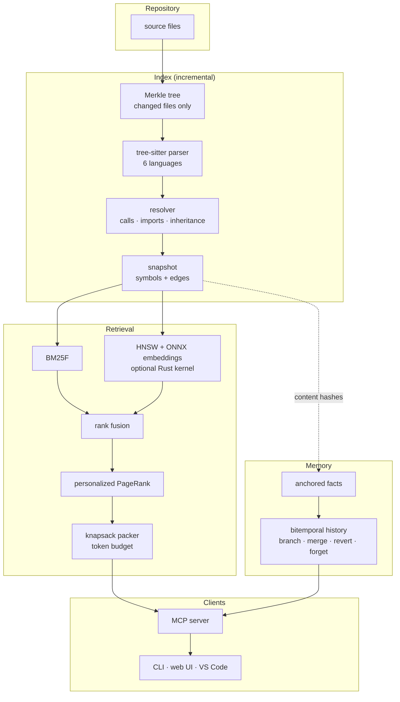
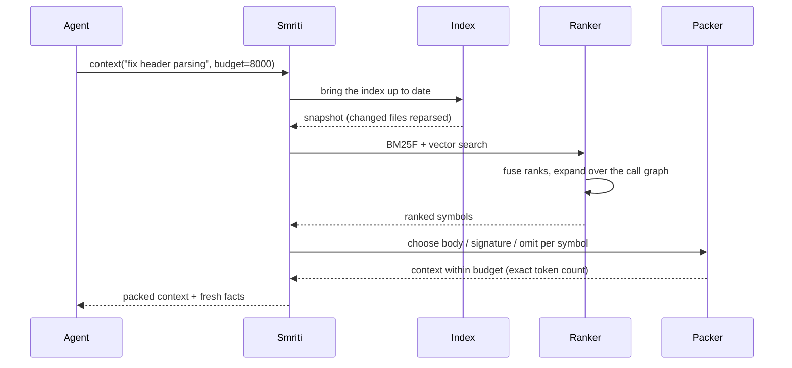

# Smriti

**A local, CPU-only memory and context engine for coding agents: it finds the code a task needs, packs it into a token budget, and remembers facts that go stale when the code they describe changes.**

[](.github/workflows/ci.yml)
[](pyproject.toml)
[](native/)
[](vscode/)
[](docs/mcp-setup.md)
[](LICENSE)

Coding agents forget everything between sessions, and they fill their context with
whole files when only a few functions matter. Smriti indexes a repository, retrieves
the relevant symbols with lexical, vector and graph signals, and packs them into a
strict token budget. It also keeps a memory of facts, each anchored to the exact code
it describes, so editing that code marks the fact stale instead of letting it mislead
the next session.

> An agent records *"`parse_header` must keep the original casing"*, anchored to
> `parse_header`. A week later someone rewrites `parse_header`. On the next
> `smriti index`, the fact is marked **stale**, and `recall --fresh-only` stops
> returning it.

---

## Contents

| Section | |
|---|---|
| [What it does](#what-it-does) | The capability surface, by area |
| [Architecture](#architecture) | How the pieces fit |
| [How a context query runs](#how-a-context-query-runs) | Retrieve, rank, pack |
| [Quick start](#quick-start) | From a clean checkout to an agent connection |
| [Results](#results) | Measured, sourced, including where it loses |
| [Design decisions](#design-decisions) | The tradeoffs, and why |
| [Repository layout](#repository-layout) | Where things live |
| [Documentation](#documentation) | Which file answers which question |

---

## What it does

| Area | Capabilities |
|---|---|
| **Indexing** | Merkle-hashed incremental indexing; tree-sitter parsing of Python, TypeScript, Java, Go, C and C++; a file watcher |
| **Resolution** | A scope-aware call and import graph, with C3 method order for Python; uncertain targets become low-confidence `may_call` edges, never claimed calls |
| **Retrieval** | BM25F over symbol fields, a custom HNSW index over local ONNX MiniLM embeddings, reciprocal rank fusion and personalized PageRank over the graph |
| **Packing** | A multiple-choice knapsack that picks each symbol's representation (full body, signature or omit) under an exact tokenizer budget, with a greedy fallback |
| **Memory** | Facts anchored to symbol content hashes, with fresh, stale and orphaned states; bitemporal history with branches that follow Git, three-way merge, revert and cascading forget |
| **Interfaces** | An MCP server (14 tools), a CLI, a localhost web UI, a VS Code extension and a Docker image |
| **Native** | An optional Rust/PyO3 kernel for HNSW distance computation, with identical results to the Python path |
| **Benchmarks** | SWE-bench Lite and Verified retrieval, LongMemEval-S, a 200-commit CodeMem replay and an agent task-success harness, with the raw results committed |

---

## Architecture

The indexer turns a repository into symbols and a graph; the retriever ranks them
for a query; the packer fits them to a budget. Memory sits beside the index and
checks every anchored fact against the latest symbol hashes.



---

## How a context query runs



---

## Quick start

Requires Python 3.12 or newer.

```bash
# 1. Install
git clone https://github.com/guru-bharadwaj20/Smriti.git
cd Smriti
python -m venv .venv
.venv/bin/pip install -e ".[vectors,dev]"     # Windows: .venv/Scripts/pip
.venv/bin/pytest

# 2. Index a repository and query it
smriti index --root /path/to/repo
smriti context "fix header parsing for empty values" --budget 8000
smriti find-symbol parse_header
smriti callers parse_header

# 3. Remember a fact anchored to code, and watch it go stale
smriti remember "parse_header must keep the original casing" --anchor SYMBOL_ID=CONTENT_HASH
smriti recall "header casing" --fresh-only
smriti memory log

# 4. Connect a coding agent over MCP (stdio)
smriti serve --root /path/to/repo
```

> `find-symbol` prints each symbol's `id` and `content_hash` for `--anchor`. Vector
> search needs the pinned ONNX model (`python -m smriti.vector.download`); it is never
> downloaded silently. The Rust kernel builds with `maturin` in [native/](native/).
> Client configuration is in [docs/mcp-setup.md](docs/mcp-setup.md); a container build
> is in [docs/docker.md](docs/docker.md).

---

## Results

Every number below comes from a committed result file. Full tables, intervals and
caveats are in [docs/report.md](docs/report.md) and [docs/results.md](docs/results.md).

### Code retrieval: SWE-bench Lite ∪ Verified

698 of 707 unique tasks were measured across 12 repositories; 9 were excluded because
the issue text contains the fix. The table shows the held-out split (516 tasks with a
gold function); tuning used only the validation split.

| Method | Function recall@10 | File recall@10 |
|---|---|---|
| BM25 | 0.291 | 0.711 |
| Exact embedding search | 0.332 | 0.703 |
| **Smriti full** | **0.355** | **0.801** |
| Smriti without vectors | 0.273 | 0.715 |
| Smriti without graph | 0.385 | 0.784 |

- **Smriti beats BM25:** +0.063 function recall@10, paired 95% interval [+0.030, +0.097].
- **It does not beat plain embedding search:** +0.023, interval [−0.011, +0.057].
- **The graph term hurts ranking:** removing it adds +0.031 [+0.009, +0.056] and makes
  ranking about 70× faster. Per-repository results and misses are in
  [docs/swebench-failures.md](docs/swebench-failures.md).

### Memory and other benchmarks

| Benchmark | Result |
|---|---|
| CodeMem: 200 real `psf/requests` commits, 64 anchored facts | stale detection precision 1.0, recall 1.0 (12,736 observations) |
| Anchors through file moves / identifier renames | 64/64 kept fresh / 64/64 flagged |
| Cascading forget on a derivation diamond | exact closure, 0 facts resurrected across 201 branches |
| LongMemEval-S (500 questions, retrieval only) | session recall@5 0.848 |
| Memory archive compression (real replay log) | 20.9% of original size, byte-identical |
| Rust distance kernel | HNSW build on Django 384 s → 55 s, identical graph |

### Agent task success

Qwen2.5-Coder-7B (CPU, temperature 0) fixed 8 injected bugs in a small fixture
repository. Given Smriti's context at 1,500 tokens it solved 8/8; given only the
file list it solved 0/8. Given the whole repository at the same budget it also
solved 8/8, because the fixture fits in the budget, so this shows Smriti's context
is sufficient, not that it beats including everything
([bench/agent/README.md](bench/agent/README.md)).

---

## Design decisions

**Local and CPU-first.** Everything runs on a laptop with no service and no API key:
tree-sitter, a 22 MB embedding model and pure-Python indexes, with an optional Rust
kernel for the one hot loop. The cost is speed on very large repositories, which the
benchmarks report rather than hide.

**Freshness is structural.** A fact is anchored to a symbol's content hash, so Smriti
can say exactly when the code under a fact changed. It cannot say whether the fact
is still true; a stale fact may still be correct. Identical-content moves keep facts
fresh; renames are flagged, not guessed.

**Resolution never overclaims.** Static analysis misses dynamic dispatch, so uncertain
targets become low-confidence `may_call` edges rather than confident calls.

**Packing is an optimization problem.** Each symbol has several representations at
different token costs; a knapsack chooses among them under an exact tokenizer count
instead of truncating files.

**Evaluation is honest by construction.** Validation and held-out splits are fixed by
a hash of the instance ID; a leakage guard rejects tasks whose issue text contains the
patch; failures are recorded, never scored as zero. Negative results stay in the
docs, including where Smriti loses to a baseline.

---

## Repository layout

```
.
├── smriti/        the engine: merkle, parse, resolve, lexical, vector, rank, pack, memory, server, ui, watch
├── native/        optional Rust/PyO3 kernel for HNSW distance computation
├── vscode/        VS Code extension (TypeScript) over the smriti CLI
├── bench/         SWE-bench, LongMemEval, CodeMem, agent and component benchmarks, with committed results
├── tests/         unit, integration and benchmark-harness tests
├── scripts/       demos, result-table generation and smoke checks
└── docs/          design, semantics, benchmarks, report, limitations
```

---

## Documentation

| Question | File |
|---|---|
| *How is it designed, and why?* | [docs/architecture.md](docs/architecture.md), [docs/design.md](docs/design.md) |
| *What do time, deletion and freshness mean?* | [docs/memory-semantics.md](docs/memory-semantics.md) |
| *How do retrieval, resolution and packing work?* | [docs/retrieval.md](docs/retrieval.md), [docs/resolution.md](docs/resolution.md), [docs/packing.md](docs/packing.md) |
| *How do I connect an agent?* | [docs/mcp-setup.md](docs/mcp-setup.md) |
| *What are the results?* | [docs/report.md](docs/report.md), [docs/results.md](docs/results.md) |
| *How do I reproduce them?* | [docs/benchmarks.md](docs/benchmarks.md), [docs/swebench-reproduction.md](docs/swebench-reproduction.md) |
| *What does it not do?* | [docs/limitations.md](docs/limitations.md) |
| *How do I develop on it?* | [docs/development.md](docs/development.md) |

---

## License

[MIT](LICENSE).
